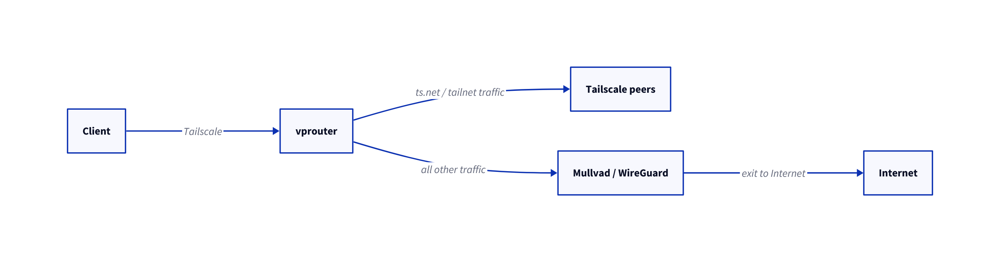

# vprouter
A containerized virtual private router that exposes a Tailscale exit node and routes internet traffic through a WireGuard VPN endpoint.

vprouter is designed around a simple idea:



The project uses manual Linux routing, iptables forwarding, and NAT instead of `wg-quick` in order to provide explicit control over packet flow and future split-tunneling support.

## Features

* Tailscale exit node inside Docker
* WireGuard VPN egress
* Manual routing configuration
* iptables forwarding and masquerading
* Bring-your-own WireGuard provider
* Persistent Tailscale state
* Minimal Alpine-based image

## Current status

Early MVP.

The current implementation successfully:

* establishes a WireGuard tunnel
* advertises itself as a Tailscale exit node
* routes Tailnet client traffic through the VPN tunnel
* preserves Tailnet reachability while tunneling internet traffic

## Limitations

Current known limitations:

* no IPv6 support
* no full kill-switch yet

## Environment variables

Copy .env.example to .env and fill in your Tailscale and WireGuard credentials.

Required values:

* Tailscale auth key (Obtainable in the [Admin Panel](https://login.tailscale.com/admin/settings/keys))
* WireGuard private key
* WireGuard peer public key
* WireGuard tunnel address
* WireGuard endpoint (address:port)
* DNS server address (must be an IPv4 address)

Optional values:

* custom Tailscale hostname
* custom AllowedIPs override

## Docker

```bash
docker run -d \
  --name vprouter \
  --cap-add=NET_ADMIN \
  --device=/dev/net/tun \
  --sysctl net.ipv4.ip_forward=1 \
  --sysctl net.ipv6.conf.all.forwarding=1 \
  -v ./tailscale:/var/lib/tailscale \
  --env-file .env \
  ghcr.io/infinit1ve/vprouter:latest
```

## Docker Compose

```yaml
services:
  vprouter:
    image: ghcr.io/infinit1ve/vprouter:latest
    env_file:
      - .env
    sysctls:
      - net.ipv4.ip_forward=1
      - net.ipv6.conf.all.forwarding=1
    cap_add:
      - NET_ADMIN
    devices:
      - /dev/net/tun
    volumes:
      - ./tailscale:/var/lib/tailscale
```

Start:

```bash
docker compose up -d
```

After startup:

1. approve the node in the Tailscale admin panel if required
2. enable it as an exit node from a Tailscale client
3. verify the public IP changes through the WireGuard provider

## How it works

vprouter creates:

* a Tailscale interface (`tailscale0`)
* a WireGuard interface (`wg0`)

Traffic flow:

```text
Tailnet traffic
    ↓
tailscale0
    ↓
iptables forwarding
    ↓
wg0
    ↓
WireGuard provider
```

The container:

* preserves direct access to the WireGuard endpoint through Docker networking
* routes default internet traffic through WireGuard
* NATs outgoing traffic through the WireGuard tunnel

## Roadmap

* kill-switch support
* encrypted upstream DNS
* safer route management
* health checks
* route policy modes
* Headscale support

## License

Apache-2.0
